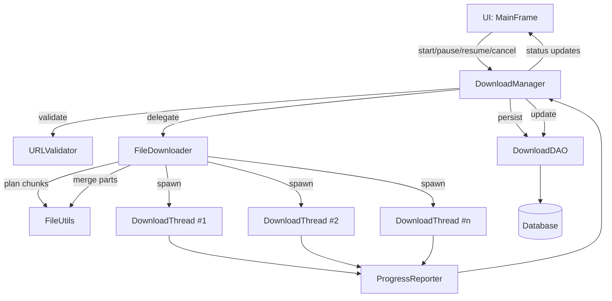
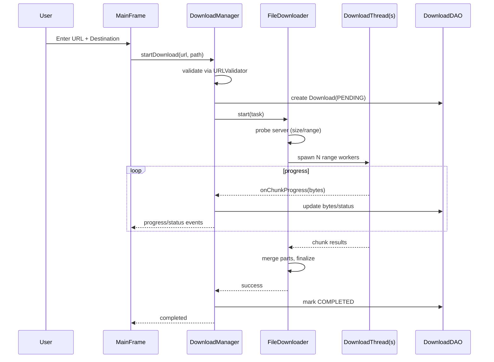

# System Architecture — fluxDL

This document describes the overall architecture of the fluxDL project, focusing on modules, responsibilities, data and control flow, concurrency, persistence, and extensibility.

## 1) High-Level Overview
- Purpose: Desktop multi-threaded download manager with resumable downloads and persistent state.
- Layers: UI → Orchestration → Domain Model → Infrastructure (Network, DB, Filesystem) → Utilities.
- Core Flow: User initiates a download in the UI; `DownloadManager` orchestrates a chunked `FileDownloader` process with multiple worker threads, persists state via DAO, and reports progress back to the UI.

```
com.sunny
├─ Main
├─ ui
│  └─ MainFrame
├─ downloader
│  ├─ DownloadManager (orchestrator)
│  ├─ FileDownloader (coordinator)
│  ├─ DownloadTask (per-download context)
│  ├─ DownloadThread (chunk worker)
│  ├─ ChunkResult (DTO)
│  └─ ProgressReporter (observer/contract)
├─ model
│  ├─ Download (entity)
│  └─ DownloadStatus (enum)
├─ database
│  ├─ DatabaseManager (connections)
│  └─ DownloadDAO (persistence)
├─ utils
│  ├─ URLValidator
│  ├─ FileUtils
│  └─ Logger
└─ exceptions
   ├─ InvalidURLException
   ├─ InsufficientSpaceException
   ├─ DownloadFailedException
   └─ DatabaseException
```

## 2) Component Responsibilities
- `com.sunny.Main`
  - Bootstraps the app, initializes UI (`MainFrame`) and core services (e.g., `DownloadManager`), wires dependencies.
- `com.sunny.ui.MainFrame`
  - Desktop UI to create, monitor, pause/resume, and cancel downloads. Subscribes to progress updates and shows statuses/errors.
- `com.sunny.downloader.DownloadManager`
  - Application service and orchestrator for the download lifecycle: validate URL, create `Download`, persist state, delegate to `FileDownloader`, aggregate progress, and handle state transitions.
- `com.sunny.downloader.FileDownloader`
  - Prepares the download execution plan (range support, content length, chunking) and manages `DownloadThread` spawning/coordination and final merge.
- `com.sunny.downloader.DownloadTask`
  - Holds per-download execution context: URL, destination, chunk plan, progress counters, references to worker threads/reporters.
- `com.sunny.downloader.DownloadThread`
  - Performs a single HTTP byte-range download, writes part data (e.g., temp files), and emits `ChunkResult` and progress.
- `com.sunny.downloader.ChunkResult`
  - Data transfer object for per-chunk completion: bytes downloaded, success/failure, exception details.
- `com.sunny.downloader.ProgressReporter`
  - Abstraction/contract for emitting progress, speed, ETA, and status changes to observers (typically the UI layer).
- `com.sunny.model.Download`
  - Domain entity representing a download (URL, path, size, bytes downloaded, status, timestamps, error message, etc.).
- `com.sunny.model.DownloadStatus`
  - Enum for lifecycle states: PENDING, IN_PROGRESS, PAUSED, COMPLETED, FAILED, CANCELED (exact values in code).
- `com.sunny.database.DatabaseManager`
  - Manages database connectivity/lifecycle, likely via JDBC.
- `com.sunny.database.DownloadDAO`
  - CRUD operations for `Download`, status/bytes updates, queries for listing/resume/history.
- `com.sunny.utils.URLValidator`
  - Validates URL format and basic constraints before starting downloads.
- `com.sunny.utils.FileUtils`
  - Filesystem helpers: destination checks, free-space verification, temp-part handling, safe merge/atomic rename, cleanup.
- `com.sunny.utils.Logger`
  - Logging utility for diagnostics.
- `com.sunny.exceptions.*`
  - Domain-specific exceptions thrown from validation, network, IO, or DB layers and handled centrally by `DownloadManager`.

## 3) Runtime Architecture


## 4) Download Lifecycle (Sequence)


## 5) Concurrency Model
- Parallelism: Each `DownloadTask` may spawn multiple `DownloadThread`s to fetch byte ranges concurrently.
- Coordination: `FileDownloader` manages worker lifecycle; `DownloadManager` aggregates progress and transitions states.
- Thread-Safety: Shared counters (e.g., total bytes) use thread-safe primitives or synchronized sections; DAO updates serialized per download.
- Back-pressure: `ProgressReporter` may throttle update frequency to avoid UI overload.
- Failure Semantics: Policy can be “fail-fast” on any chunk error or use bounded retries per chunk before failing the task.

## 6) Persistence Model
- Storage: Database accessed through `DatabaseManager` and `DownloadDAO`.
- Entity: `Download` rows capture current state and enable resume/history.
- Typical fields:
  - id (PK), url, file_path, status, size_bytes, bytes_downloaded,
  - created_at, updated_at, error_message, etag/last_modified (optional for integrity/resume hints).
- Operations:
  - Insert on creation; periodic updates to `bytes_downloaded` and `status`; query by id/list; cleanup/history.

## 7) Networking & Filesystem
- HTTP: Use byte-range requests when supported; probe content length and range capability; configure timeouts and retries.
- Filesystem:
  - Temp part files (e.g., `<filename>.part{index}`) per chunk.
  - On success, merge parts in order and perform atomic rename to final file.
  - Validate free disk space up-front; cleanup partials on failure/cancel.
- Integrity: Optionally verify final size (and/or ETag/Last-Modified) before completion.

## 8) Error Handling & Recovery
- Validation Errors: `InvalidURLException` surfaced immediately to UI with no worker spawn.
- IO/Network: `DownloadFailedException` from workers; retry policy at chunk level; escalate to task failure if unrecoverable.
- Filesystem: `InsufficientSpaceException` blocks start or triggers failure with cleanup.
- Database: `DatabaseException` logs and surfaces to UI; app remains responsive.
- Resume: Persisted progress and remaining ranges allow resuming when range requests are supported.

## 9) Configuration & Extensibility
- Threading: Configurable number of chunks/threads per download.
- Retries/Timeouts: Policy parameters for workers and overall task.
- Storage: Replace DB engine by adjusting `DatabaseManager`/`DownloadDAO` without changing higher layers.
- Protocols: Add FTP/S3 by introducing new downloader implementations and delegating via `DownloadManager`.
- UI: Additional views (history/logs) subscribe to `ProgressReporter` without coupling to downloader internals.

## 10) Non-Functional Considerations
- Performance: Parallel chunking to maximize throughput; avoid blocking UI thread.
- Robustness: Resume support, safe partial file handling, and atomic finalization.
- Reliability: Consistent state transitions and persisted checkpoints.
- Security: URL validation, safe path handling, TLS verification, and log sanitization.

## 11) Quick Class Reference
- Orchestration: `DownloadManager`
- Execution: `FileDownloader`, `DownloadTask`, `DownloadThread`
- Progress: `ProgressReporter`, `ChunkResult`
- Domain: `Download`, `DownloadStatus`
- Persistence: `DatabaseManager`, `DownloadDAO`
- Utilities: `URLValidator`, `FileUtils`, `Logger`
- Exceptions: `InvalidURLException`, `InsufficientSpaceException`, `DownloadFailedException`, `DatabaseException`

---
If you want this embedded into `documentation.md` or split into a `/docs` folder with separate diagrams and a contribution guide, let me know and I can organize it accordingly.